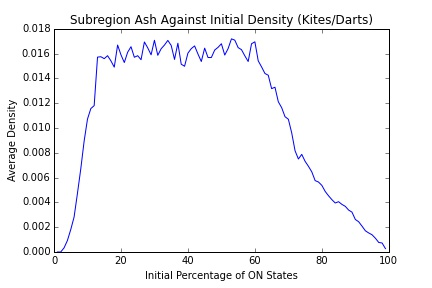

#Implementation Journal
__More recent entries are at the top.__

##2-3-2016

##2-1-2016

###Penrose Life Subregion Analysis 

The larger Penrose grids were created with the intention of emulating a smaller grid with 'lazily' expanding boundaries. Thus, the ash density within the initialized subregion should be measured as well as the overall ash density. Below are the results from subregion ash density analysis:

####Subregion Kites and Darts

A graph of the final subregion ash density against starting initial configuration. Unsurprisingly, there is a steep fall off in final ash density when the starting configuration is more dense, as the overcrowding life criteria would cause many structures to disintegrate.

The distribution of subregion densities is remarkably similar to the density graph for Kites/Darts shown in [journal entry 1-19](#1-19-2016).

####Subregion Rhombs

Like the kites/darts graph, there is a steep fall off in final ash density at higher density initial starting configurations. There appear to be significant fluctuations in the final ash density for starting configurations between 20% and 60% ON, which will be investigated.

Again, in comparison to the density graph for Rhombs on a smaller grid. the final ash density distribution is quite similar. There are however, a larger amount configurations that yield no ash whatsoever, perhaps indicating that due to the lazily expanding boundaries as well as the higher average lifetime of RhombLife, the ash may have settled outside the initial subregion. Further investigation of runs that contain ash in the boundary area but not the initial starting subregion must be conducted.

##1/27/2016

Implemented "spreading activation" of rule table updates, results in slight speed up of computation.

##1/26/2016

###Stoma Local Majority Experiments

With a stitched image of plant stomata, provided by David Peak (Utah State), we built corresponding Delaunay Triangulations and Voronoi Diagrams. We ran the same local majority experiments on the stoma grid as before, with similar results:

Again, we see remarkably similar behavior as the results presented in Messinger et al. with regular grids, with performance degrading in a symmetric band between 20-80 percent initial starting density.

####Meeting with Duane
- Presentation is a month out, keep this in mind/continue foundation of presentation
- Outline due at some point?
- Continue momentum with experiments
- Write README file for the system
- Meetings during the semester Tues at 4pm, Friday at 11am

####Experiments
- Look at density within the 'petri dish,' as well as examine ash outside of the petri dish
- additional metrics we need to look at: power laws, revisit Peak's work, Calculi of Emergence (cr94)
- finish implementation of Wootter's work

##1/25/2016

Added additional scripting capabilities to main, created stoma graphs and ran local majority experiments on the stoma graph. Results coming.

####To-Do List
-Optimization of RuleTable cell updates
-Reproduction of rotation rules for Wootters experiments
-Scriptify Grid Generator functions

##1/23/2016

###Sub-Regioned Penrose Tilings

In order to see both the potential border effects as well as size effects on the lifetime of both types of Penrose tilings, we ran a lifetime experiment on a much larger grid, with a subregion of initialization that was chosen to match the smaller grid as close as possible. The idea is to replicate the original starting configurations of our first set of lifetime experiments but providing more grid-space. 100 different initial configurations for each starting ON-density (1 to 99) were simulated, for 9900 data points. The average lifetime graphs, as compared to the corresponding smaller grid lifetimes, are shown below:

For the kites/darts grids, there is not a significant increase in lifetime at the peak initial densities on the larger grid, though the larger grid appears to have less of a fall-off of average lifetime at the higher initial densities.

For the thin/thick rhomb grids, there is a large increase in lifetimes across all densities. These results seem to be reasonable, as more grid space would allow structures to propagate longer distances without collisions with a boundary. Further analysis is needed to see the potential effects of the border cells on the larger grid.

<s>The ash density graphs again show no correlation between ash density and starting configuration, although on average the larger grids have higher ash densities than the smaller graphs. This is not surprising, as there is more "real estate" for static structures and oscillators to populate the area without being disturbed.</s>

__EDIT:__ The above ash density graphs are incorrect, as the ash density numbers have been inflated due to a calculation error. See the journal entry on 2/1 for correct ash analysis.

##1/22/2016

Implemented subregion initialization, learned about C++ lambda functions in the process. Kicked off AshLife computation on subregioned Penrose tilings.

####To-Do List
- Optimize cell updates by only checking cells that had neighbors change the previous time step
- Test this by reproducing some earlier work with the same seeds, initial configurations, etc.
- Implement the invariant rotation rules for reproducing Wootters experiments
- Run the same Penrose life experiments on the larger grids, with the subregion technique discussed
- Modularize/scriptify main

##1/21/2016

###Neighborhood On Frequency

Found two papers by Owen and Stepney with detailed ash and oscillator analysis of both kite/darts and thin/thick rhombs. Our data collected thus far passes the eye test in terms of agreeing with their data. However, Owen and Stepney utilize a lazily growing Penrose tiling while we use set boundaries, and so we may get some differing behavior at our boundaries. To investigate this, we recorded the ON frequency of different neighborhood sizes throughout the lifetime of a long Rhomb run. The results are shown below:

Neighborhood sizes of 6 or less only occur at the boundaries, and are not "true" rhomb neighborhoods. We do see some activity throughout the lifetime of the simulation at these border cells. Thus, we need to minimize border effects if we want to compare with Owen and Stepney's results. One option we will be exploring is to place an initial starting configuration within a subregion of a larger graph.

###Meeting with Duane
- Need ability to initialize based on soup sizes
- working towards optimized rule table updates
- two stage rule table for invariant rotation rules
- thinking about presentations, greyscale coloring of grids?

##1/20/2016

###Circular Penrose Analysis Continued

The Lifetime to Stability graph shown above highlights the large difference in average lifetimes between the rhomb Penrose grids and the kite/dart Penrose grids.

In the neighborhood size frequency chart shown above, the most frequent neighborhood size for kites/darts is 9, whereas the most frequent neighborhood size for thin/thick rhobms is 10. The average neighborhood size for kites/darts is __8.360__, and the average neighborhood size for thin/thick rhombs is __8.824__. It makes sense that increased connectivity would allow for longer lifetimes, as there would be more opportunities for birth. Whether there are other properties (geometric, perhaps?) that influence the lifetime of the simulation is unclear and needs to be investigated further.

####Longest Run Thin/Thick Rhombus

The longest run of the thin/thick rhombs had a lifetime of 666 timesteps, with a final ash density of 0.0279%.

####Thin/Thick Rhomb Oscillators
The following is a thin/thick rhombus run with three oscillators: a p2 plinker in the lower left, a p5 oscillator on the left boundary, and a p4 "crown" in the center (detected period of 20). Initial starting density is 39%.

The longest detected oscillator in the this particular thin/thick rhombus grid is the following p18 oscillator, appearing in a configuration with a starting density of 59%. Both the entire run and the oscillator itself is shown.

A p9 oscillator is shown below. Many oscillators appear to live on or near the boundaries of the grid.

##1-19-2016

###Circular Penrose (Kites and Darts)

Both the lifetime to stability and ash density graphs yield similar results as the rhombus kite-dart grid, with a right skewed lifetime-to-stability and no correlation in the ash density. However, there is a slight uptick in average lifetime, which is surprising since the circular grid actually contains less cells than the rhombus grid.

The longest period run has a "period" of 60 (initial ON percentage 42%); closer examination shows that there are three oscillators: a p2 plinker, a p4 bat, and a p15 "wheel." The least common multiple of the three periods is 60, giving the detected period of 60, shown below.

The longest period oscillator detected in this configuration is a p16 oscillator shown below (initial ON percentage of 39%) :

###Circular Penrose (Thin and Thick Rhombuses)

Again, the graphs have roughly the same shape, and have the same distribution range of ash densities. However, with the thin and thick rhombuses, the average lifetime is much higher, with many runs taking as long as 600 timesteps to stabilize (longest seen is 666 timesteps).

##1/18/2016 

####To-Do List
- Voronoi-Weighted neighborhood mapping
- Moore neighborhood mapping for quads -> lambda experiments

Morning: Implemented Experiment framework for queuing simulations, ran Penrose long lifetime simulations. Also planned out a replication of Wootters and Langton's work on lambda. 

Important parameters:
- Moore neighborhood with 8 states (N = 5, K = 8)
- The bitstring representation will require 2^(3*5) * 3 = 98304, 96k bits.
- The state
- 64x64 grid with __periodic__ boundary conditions
- entropy is $H = - \sum_{s=0}^7 p_s \log p_s$, where $p_i$ is the frequency of a particular state

###Results from a Long Penrose Life Run

After utilizing a Vertex Stencil (giving a degree of either 8 or 9) for the Penrose tilings, we see much longer average lifetime stability. The longest run from the simulation results presented yesterday had an active lifetime of 173 timesteps before periodic behavior set in. 

As seen in this lifetime graph, the ON-density of the Penrose tiling quickly falls to near typical ash density levels and stays close to constant over a majority of its lifetime. We hypothesize that this behavior would be indicative of ash stabilizing relatively quickly with a small glider-like structure being primarily responsible for the long lifetime. Looking at the actual simulation, this seems to be the case, with a roughly amorphous moving structure in the upper left corner for majority of the simulation (seen below). Otherwise, the ash settles relatively quickly, with a "plinker" (coined by Hill et al.) oscillator present on the right side of the tiling.

##1/17/2016
Results from vertex stencil ash life:

###Penrose (Vertex) Ash Life Experiment 

When considering neighborhoods with shared vertices as in Hill et al., we see remarkably similar behavior on both graphs as shown in the Hill paper, with a right skewed Lifetime to Stability graph and little correlation between lifetime and ash density.

##1/15/2016
Today, implemented a vertex stencil. A rough approximation of Moore neighborhood (disregarding orientation) would be determining a cell's neighborhood by shared edges. Thus, an equivalent approximation of the von Neumann neighborhood would be determining a cell's neighborhood by shared vertices. Ran extensive Ash Life tests with the new stencils. Also fixed bugs in GridGenerator and RuleTable.

A "bat" oscillator in Kite-Dart Penrose Life with a vertex stencil:

##1/14/2016
Morning: Ran Penrose Ash Life tests

####To-Do List
- Voronoi-Weighted neighborhood mapping
- Plant cell grid orientation
- GoL Rule Table mapping
- Periodicity Analysis

###Penrose Ash Life Experiment

A visualization of the Penrose tiling used (kites and darts).

The same Penrose tiling, with only graph connectivity shown.

####Lifetime and Ash Density Analysis

The lifetime graph shows an asymmetry in the mean lifetimes to stability in relation to the initial density. Interestingly, the asymmetry is left-skewed whereas the data shown in Hill et al. is right-skewed. There also appears to be a relationship between ash density as well as lifetime to stability. Ordinary least squares yields a fit with an adjusted R^2 value of 0.914. These differences may be due to the particular shape of the Penrose tiling.

###Period 7 Voronoi Oscillator

An animation of a GoL simulator with a 54% initial ON percentage ~(25x25). Oscillation occurs after 39 timesteps with a period 7 oscillator. The final ash density is 5.7%. The oscillator is shown below.

##1/13/2016
Morning: Added capability to show state in graphviz graphs.
Afternoon: Debugged BinaryRuleTable and built stable graph visualizations
###Stable State Graph Visualizations

The stable graph state for a local majority simulation with a 72% initial ON percentage ~(15x15). Stabilization occurs after 6 timesteps, with the graph failing to converge to the majority state (88.9% ON).

The "stable" graph state for a GoL simulation with a 35% initial ON percentage ~(25x25). Oscillation occurs after 32 timesteps, with a period 3 oscillator. Final ash density is 10.5%.

The previous configuration (all timesteps), animated.

##1/12/2016
Morning Goals:
- Run some Life ash experiments
- Produce some pictures of LM stable states

For examining ash in GoL:

Relevant Parameters:
- Grid sizes: Small (~25x25), Med (~44x44), Large (~72x72), XLarge (118x118)
- Mean lifetime to Stability experiment: Plot Initial Density (1% to 100%) against Mean Lifetime
- Lifetime to stability against ash density, for initial densities D = 20%, 40%, 60%.

###Results of Ash Life Experiment

####Small Grids

####Medium Grids

The Lifetime Stability graphs show a symmetry in the lifetimes not found in the Penrose tilings (hi05). There may also be a weak correlation between ash density and lifetime to stability, particularly shown in the medium grid scatter plot.

###To-Do List
- Implement "spreading activation" method of updating graph (optimizing, can track the number of states changing per timestep)
- Hex grid 
- Toroidal Voronoi diagrams
- Visualizations of grids

##1/11/2016
Morning: Implemented Regular Grid Generator, some basic stencils.

###Results of Local Majority Baseline Experiment (Regular, Non-Periodic)

These results show a more rapid degradation in performance than in me07, though this may be due to the non-periodic boundaries.

###Results of Local Majority Baseline Experiment (Regular, Periodic)

With periodic boundaries, we replicate the results found in the initial experiment, as shown below (Figure 2, me07):

##1/8/2016
Morning Goal: Set up replication of Messinger et al.'s (me07) baseline local majority computation. 

Relevant Parameters:
- 15 by 15 grid (225 cells)
- Increments of 1 percent from 1:99 on/off ratio to 99:1
- Maximum of 450 time steps
- Only concerned with completely correct classification
- 1000 randomly assigned initial network configurations for each initial ratio

Afternoon: Finished replication of LM baseline computation. In order to account for variations in irregular grids, ran 10 different grid configurations with 100 random initial starting configruations for each initial ratio, for 1000 total.

1,000 simulations takes ~2.5 minutes, 10,000 simulations takes ~20-25 minutes.

###Goals for Tuesday
- Look at Wooters (wo90), Hill (hi05), Messinger (me07) for any other experiments that can be easily performed
- Replicate LM Baseline with a standard regular grid to verify correct performance
- Have some basic visualization of the interesting values for LMBaseline
- Keep scripting and modularity in mind, look into rigging up call-back functions

###Results of Local Majority Baseline Experiment (Irregular)

These graphs resemble the same data presented in Messinger for regular grids, with symmetric degradation of performance for both ON and OFF majority. However, there is a slightly slower degradation of performance in the irregular case than the regular case, with approximately 60% task performance for irregular configurations at 20:80 and 80:20 and approximately 40% task performance for regular configurations at 20:80 and 80:20 (me07). We will exactly replicate the original Messinger experiments as a comparison.

##1/7/2016
Morning: Finished SimpleMajorityRule as well as RuleTable and Stencil. Rudimentary majority task simulations can now be run.

Afternoon: Laid out foundation for updating and writing metrics within the Simulator event loop. 

Evening: Implemented a simple checksum using STD hash to store previous grid state. TODO implement md5 hash for the checksum, STD hash collision rate remains to be tested.

##1/6/2016
This morning: implemented variatic Properties to be stored in cells using unions. GridGenerators can now write different property lists to file.

This afternoon: laid out foundation for Stencil class, which maps a rule table to an irregular neighborhood. SimpleMajorityRule almost complete.

##1/5/2016

###__Week 1 Goals__
- Get a working simulation up and running, with rule applications and simple statistics tracking
- Concept of a Rule Table ("traditional" rule numbering/declarations) and Rule Mapping (to irregular grids)

Today, laid out the foundation of the Simulation class, and it now performs a dummy
simulation. Next steps are to continue to flesh out the Simulation so that actual
computation is being performed.

Things to keep in mind:
- Scriptability
- Modularity