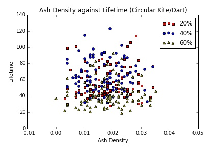

#Implementation Journal
__More recent entries are at the top.__

##1/19/2016

###Circular Penrose (Kites and Darts)

Both the lifetime to stability and ash density graphs yield similar results as the rhombus kite-dart grid, with a right skewed lifetime-to-stability and no correlation in the ash density. However, there is a slight uptick in average lifetime, which is surprising since the circular grid actually contains less cells than the rhombus grid.

The longest period run has a "period" of 60 (initial ON percentage 42%); closer examination shows that there are three oscillators: a p2 plinker, a p4 bat, and a p15 "wheel." The least common multiple of the three periods is 60, giving the detected period of 60, shown below.

The longest period oscillator detected in this configuration is a p16 oscillator shown below (initial ON percentage of 39%) :

##1/18/2016 

####To-Do List
- Voronoi-Weighted neighborhood mapping
- Moore neighborhood mapping for quads -> lambda experiments

Morning: Implemented Experiment framework for queuing simulations, ran Penrose long lifetime simulations. Also planned out a replication of Wootters and Langton's work on lambda. 

Important parameters:
- Moore neighborhood with 8 states (N = 5, K = 8)
- The bitstring representation will require 2^(3*5) * 3 = 98304, 96k bits.
- The state
- 64x64 grid with __periodic__ boundary conditions
- entropy is $H = - \sum_{s=0}^7 p_s \log p_s$, where $p_i$ is the frequency of a particular state

###Results from a Long Penrose Life Run

After utilizing a Vertex Stencil (giving a degree of either 8 or 9) for the Penrose tilings, we see much longer average lifetime stability. The longest run from the simulation results presented yesterday had an active lifetime of 173 timesteps before periodic behavior set in. 

As seen in this lifetime graph, the ON-density of the Penrose tiling quickly falls to near typical ash density levels and stays close to constant over a majority of its lifetime. We hypothesize that this behavior would be indicative of ash stabilizing relatively quickly with a small glider-like structure being primarily responsible for the long lifetime. Looking at the actual simulation, this seems to be the case, with a roughly amorphous moving structure in the upper left corner for majority of the simulation (seen below). Otherwise, the ash settles relatively quickly, with a "plinker" (coined by Hill et al.) oscillator present on the right side of the tiling.

##1/17/2016
Results from vertex stencil ash life:

###Penrose (Vertex) Ash Life Experiment 

When considering neighborhoods with shared vertices as in Hill et al., we see remarkably similar behavior on both graphs as shown in the Hill paper, with a right skewed Lifetime to Stability graph and little correlation between lifetime and ash density.

##1/15/2016
Today, implemented a vertex stencil. A rough approximation of Moore neighborhood (disregarding orientation) would be determining a cell's neighborhood by shared edges. Thus, an equivalent approximation of the von Neumann neighborhood would be determining a cell's neighborhood by shared vertices. Ran extensive Ash Life tests with the new stencils. Also fixed bugs in GridGenerator and RuleTable.

A "bat" oscillator in Kite-Dart Penrose Life with a vertex stencil:

##1/14/2016
Morning: Ran Penrose Ash Life tests

####To-Do List
- Voronoi-Weighted neighborhood mapping
- Plant cell grid orientation
- GoL Rule Table mapping
- Periodicity Analysis

###Penrose Ash Life Experiment

A visualization of the Penrose tiling used (kites and darts).

The same Penrose tiling, with only graph connectivity shown.

####Lifetime and Ash Density Analysis

The lifetime graph shows an asymmetry in the mean lifetimes to stability in relation to the initial density. Interestingly, the asymmetry is left-skewed whereas the data shown in Hill et al. is right-skewed. There also appears to be a relationship between ash density as well as lifetime to stability. Ordinary least squares yields a fit with an adjusted R^2 value of 0.914. These differences may be due to the particular shape of the Penrose tiling.

###Period 7 Voronoi Oscillator

An animation of a GoL simulator with a 54% initial ON percentage ~(25x25). Oscillation occurs after 39 timesteps with a period 7 oscillator. The final ash density is 5.7%. The oscillator is shown below.

##1/13/2016
Morning: Added capability to show state in graphviz graphs.
Afternoon: Debugged BinaryRuleTable and built stable graph visualizations
###Stable State Graph Visualizations

The stable graph state for a local majority simulation with a 72% initial ON percentage ~(15x15). Stabilization occurs after 6 timesteps, with the graph failing to converge to the majority state (88.9% ON).

The "stable" graph state for a GoL simulation with a 35% initial ON percentage ~(25x25). Oscillation occurs after 32 timesteps, with a period 3 oscillator. Final ash density is 10.5%.

The previous configuration (all timesteps), animated.

##1/12/2016
Morning Goals:
- Run some Life ash experiments
- Produce some pictures of LM stable states

For examining ash in GoL:

Relevant Parameters:
- Grid sizes: Small (~25x25), Med (~44x44), Large (~72x72), XLarge (118x118)
- Mean lifetime to Stability experiment: Plot Initial Density (1% to 100%) against Mean Lifetime
- Lifetime to stability against ash density, for initial densities D = 20%, 40%, 60%.

###Results of Ash Life Experiment

####Small Grids

####Medium Grids

The Lifetime Stability graphs show a symmetry in the lifetimes not found in the Penrose tilings (hi05). There may also be a weak correlation between ash density and lifetime to stability, particularly shown in the medium grid scatter plot.

###To-Do List
- Implement "spreading activation" method of updating graph (optimizing, can track the number of states changing per timestep)
- Hex grid 
- Toroidal Voronoi diagrams
- Visualizations of grids

##1/11/2016
Morning: Implemented Regular Grid Generator, some basic stencils.

###Results of Local Majority Baseline Experiment (Regular, Non-Periodic)

These results show a more rapid degradation in performance than in me07, though this may be due to the non-periodic boundaries.

###Results of Local Majority Baseline Experiment (Regular, Periodic)

With periodic boundaries, we replicate the results found in the initial experiment, as shown below (Figure 2, me07):

##1/8/2016
Morning Goal: Set up replication of Messinger et al.'s (me07) baseline local majority computation. 

Relevant Parameters:
- 15 by 15 grid (225 cells)
- Increments of 1 percent from 1:99 on/off ratio to 99:1
- Maximum of 450 time steps
- Only concerned with completely correct classification
- 1000 randomly assigned initial network configurations for each initial ratio

Afternoon: Finished replication of LM baseline computation. In order to account for variations in irregular grids, ran 10 different grid configurations with 100 random initial starting configruations for each initial ratio, for 1000 total.

1,000 simulations takes ~2.5 minutes, 10,000 simulations takes ~20-25 minutes.

###Goals for Tuesday
- Look at Wooters (wo90), Hill (hi05), Messinger (me07) for any other experiments that can be easily performed
- Replicate LM Baseline with a standard regular grid to verify correct performance
- Have some basic visualization of the interesting values for LMBaseline
- Keep scripting and modularity in mind, look into rigging up call-back functions

###Results of Local Majority Baseline Experiment (Irregular)

These graphs resemble the same data presented in Messinger for regular grids, with symmetric degradation of performance for both ON and OFF majority. However, there is a slightly slower degradation of performance in the irregular case than the regular case, with approximately 60% task performance for irregular configurations at 20:80 and 80:20 and approximately 40% task performance for regular configurations at 20:80 and 80:20 (me07). We will exactly replicate the original Messinger experiments as a comparison.

##1/7/2016
Morning: Finished SimpleMajorityRule as well as RuleTable and Stencil. Rudimentary majority task simulations can now be run.

Afternoon: Laid out foundation for updating and writing metrics within the Simulator event loop. 

Evening: Implemented a simple checksum using STD hash to store previous grid state. TODO implement md5 hash for the checksum, STD hash collision rate remains to be tested.

##1/6/2016
This morning: implemented variatic Properties to be stored in cells using unions. GridGenerators can now write different property lists to file.

This afternoon: laid out foundation for Stencil class, which maps a rule table to an irregular neighborhood. SimpleMajorityRule almost complete.

##1/5/2016

###__Week 1 Goals__
- Get a working simulation up and running, with rule applications and simple statistics tracking
- Concept of a Rule Table ("traditional" rule numbering/declarations) and Rule Mapping (to irregular grids)

Today, laid out the foundation of the Simulation class, and it now performs a dummy
simulation. Next steps are to continue to flesh out the Simulation so that actual
computation is being performed.

Things to keep in mind:
- Scriptability
- Modularity